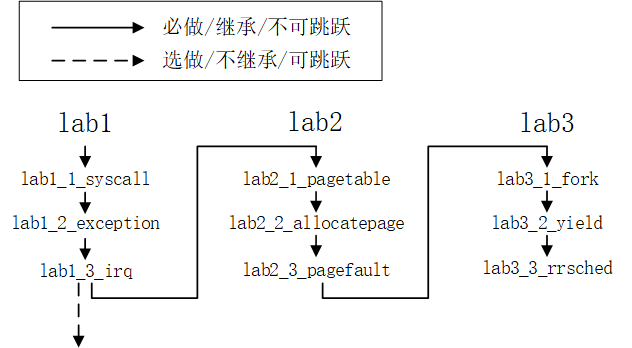

# 第二章．实验环境配置与实验构成

### 目录  
- [2.1 实验环境安装](#environments)
  - [2.1.1 头歌平台](#subsec_educoder)  
  - [2.1.2 Windows环境（WSL）](#subsec_windows)
  - [2.1.3 Ubuntu操作系统环境](#subsec_ubuntu)  
  - [2.1.4 openEuler操作系统环境](#subsec_openeuler)  
- [2.2 riscv-pke（实验）代码的获取](#preparecode)
- [2.3 PKE实验构成](#pke_experiemnts)

<a name="environments"></a>

## 2.1 实验环境安装

<a name="subsec_educoder"></a>

### 2.1.1 头歌平台

PKE实验在[头歌平台](https://www.educoder.net/)上进行了部署，但因为仍在测试阶段，所以没有开放全局选课（感兴趣的读者可以尝试邀请码：2T8MA）。PKE实验（2.0版本）将于2021年秋季在头歌平台重新上线，届时将开放全局选课。


图1.1 头歌课程界面。

头歌平台为每个选课的学生提供了一个docker虚拟机，该虚拟机环境中已经配置好了所有开发套件（包括交叉编译器、Spike模拟器等），用户可以通过shell选项（*详细使用方法将待2.0上线时更新*）进入该docker环境在该docker环境中完成实验任务。


<a name="subsec_windows"></a>

### 2.1.2 Windows环境（WSL）

如果读者的工作环境是Windows10的专业版，可采用WSL（Windows Subversion Linux）+MobaXterm的组合来搭建PKE的实验环境。在Windows10专业版上配置该环境的说明，可以参考[这里](https://zhuanlan.zhihu.com/p/81769058)。

需要说明的是，PKE实验并不需要中文字体、图形界面或者JAVA的支持，所以读者在安装WSL的过程中无须安装于汉化相关的包，也无需安装xfce、JDK等。只需要安装WSL的基础环境后，再按照[下一节](#subsec_ubuntu)的说明继续完成PKE开发环境的安装。


<a name="subsec_ubuntu"></a>

### 2.1.3 Ubuntu操作系统环境

实验环境我们推荐采用Ubuntu 16.04LTS或18.04LTS（x86_64）操作系统，以及WSL中的相应版本。我们未在其他系统（如arch，RHEL等）上做过测试，但理论上只要将实验中所涉及到的安装包替换成其他系统中的等效软件包，就可完成同样效果。另外，我们在EduCoder实验平台（网址：https://www.educoder.net ）上创建了本书的同步课程，课程的终端环境中已完成实验所需软件工具的安装，所以如果读者是在EduCoder平台上选择的本课程，则可跳过本节的实验环境搭建过程，直接进入通过终端（命令行）进入实验环境。

PKE实验涉及到的工具软件有：

- RISC-V交叉编译器（及附带的主机编译器、构造工具等）；
- spike模拟器；


以下分别介绍这两个部分的安装过程。对于新安装的Ubuntu操作系统，**我们强烈建议读者在新装环境中完整构建（build）RISC-V交叉编译器，以及spike模拟器**。（对于熟练用户）为了避免耗时且耗资源的构建（build）过程，一个可能的方案是从https://toolchains.bootlin.com 下载，**但是要注意一些依赖包（如GCC）的版本号**。如果强调环境的可移植性，可以考虑在虚拟机中安装完整系统和环境，之后将虚拟机进行克隆和迁移。

#### RISC-V交叉编译器

RISC-V交叉编译器是与Linux自带的GCC编译器类似的一套工具软件集合，不同的是，x86_64平台上Linux自带的GCC编译器会将源代码编译、链接成为适合在x86_64平台上运行的二进制代码（称为native code），而RISC-V交叉编译器则会将源代码编译、链接成为在RISC-V平台上运行的代码。后者（RISC-V交叉编译器生成的二进制代码）是无法在x86_64平台（即x86_64架构的Ubuntu环境下）直接运行的，它的运行需要模拟器（我们采用的spike）的支持。

一般情况下，我们称x86_64架构的Ubuntu环境为host，而在host上执行spike后所虚拟出来的RISC-V环境，则被称为target。RISC-V交叉编译器的构建（build）、安装过程如下：

● 第一步，安装依赖库

RISC-V交叉编译器的构建需要一些本地支撑软件包，可使用以下命令安装：

`$ sudo apt-get install autoconf automake autotools-dev curl libmpc-dev libmpfr-dev libgmp-dev gawk build-essential bison flex texinfo gperf libtool patchutils bc zlib1g-dev libexpat-dev device-tree-compiler`

● 第二步，获取RISC-V交叉编译器的源代码

有两种方式获得RISC-V交叉编译器的源代码：一种是通过源代码仓库获取，使用以下命令：

`$ git clone --recursive https://github.com/riscv/riscv-gnu-toolchain.git`

但由于RISC-V交叉编译器的仓库包含了Qemu模拟器的代码，下载后的目录占用的磁盘空间大小约为4.8GB，（从国内下载）整体下载所需的时间较长。为了方便国内用户，我们提供了另一种方式就是通过百度云盘获取源代码压缩包，链接和提取码如下：

`链接: https://pan.baidu.com/s/1cMGt0zWhRidnw7vNUGcZhg 提取码: qbjh`

从百度云盘下载RISCV-packages/riscv-gnu-toolchain-clean.tar.gz文件（大小为2.7GB），再在Ubuntu环境下解压这个.tar.gz文件，采用如下命令行：

`$ tar xf  riscv-gnu-toolchain-clean.tar.gz`

之后就能够看到和进入当前目录下的riscv-gnu-toolchain文件夹了。

● 第三步，构建（build）RISC-V交叉编译器

`$ cd riscv-gnu-toolchain`

`$ ./configure --prefix=[your.RISCV.install.path]`

`$ make`

以上命令中，[your.RISCV.install.path]指向的是你的RISC-V交叉编译器安装目录。如果安装是你home目录下的一个子目录（如~/riscv-install-dir），则最后的make install无需sudoer权限。但如果安装目录是系统目录（如/opt/riscv-install-dir），则需要sudoer权限（即在make install命令前加上sudo）。

● 第四步，设置环境变量

`$ export RISCV=[your.RISCV.install.path]`

`$ export PATH=$PATH:$RISCV/bin`

以上命令设置了RISCV环境变量，指向在第三步中的安装目录，并且将交叉编译器的可执行文件所在的目录加入到了系统路径中。这样，我们就可以在PKE的工作目录调用RISC-V交叉编译器所包含的工具软件了。

#### spike模拟器

接下来，安装spkie模拟器。首先取得spike的源代码，有两个途径：一个是从github代码仓库中获取：

`$ git clone https://github.com/riscv/riscv-isa-sim.git`

也可以从百度云盘中下载spike-riscv-isa-sim.tar.gz文件（约4.2MB），然后用tar命令解压缩。百度云盘的地址，以及tar命令解压缩可以参考2.1.1节RISC-V交叉编译器的安装过程。获得spike源代码或解压后，将在本地目录看到一个riscv-isa-sim目录。

接下来构建（build）spike，并安装：

`$ cd riscv-isa-sim`

`$ ./configure --prefix=$RISCV`

`$ make`

`$ make install`

在以上命令中，我们假设RISCV环境变量已经指向了RISC-V交叉编译器的安装目录，即[your.RISCV.install.path]。


<a name="subsec_openeuler"></a>

### 2.1.4 openEuler操作系统

PKE实验将提供基于华为openEuler操作系统的开发方法，*具体的华为云使用方法待续*，但在openEuler操作系统环境中的交叉编译器安装方法，以及其他环节都可参考[2.1.3 Ubuntu环境](#subsec_ubuntu)的命令进行。 


<a name="preparecode"></a>

## 2.2 riscv-pke（实验）代码的获取

以下讨论，我们假设读者是使用的Ubuntu/openEuler操作系统，且已按照[2.1.2](#subsec_ubuntu)的说明安装了需要的工具软件。对于头歌平台而言，代码已经部署到实验环境，读者可以通过头歌网站界面或者界面上的“命令行”选项看到实验代码，所以头歌平台用户无须考虑代码获取环节。

#### 代码获取

在Ubuntu/openEuler操作系统，可以通过以下命令下载riscv-pke的实验代码：

（克隆代码仓库）

```
`$ git clone https://gitee.com/hustos/riscv-pke-prerelease.git
Cloning into 'riscv-pke-prerelease'...
remote: Enumerating objects: 195, done.
remote: Counting objects: 100% (195/195), done.
remote: Compressing objects: 100% (195/195), done.
remote: Total 227 (delta 107), reused 1 (delta 0), pack-reused 32
Receiving objects: 100% (227/227), 64.49 KiB | 335.00 KiB/s, done.
Resolving deltas: 100% (107/107), done.`
```

克隆完成后，将在当前目录应该能看到riscv-pke-prerelease目录。这时，可以到riscv-pke目录下查看文件结构，例如：

`$ cd riscv-pke-prerelease`

切换到lab1_1_syscall分支（因为lab1_1_syscall是默认分支，这里也可以不切换）
`$ git checkout lab1_1_syscall`

`$ tree -L 3`

（将看到如下输出）

```
.
├── LICENSE.txt
├── Makefile
├── README.md
├── grade.py
├── kernel
│   ├── config.h
│   ├── elf.c
│   ├── elf.h
│   ├── kernel.c
│   ├── kernel.lds
│   ├── machine
│   │   ├── mentry.S
│   │   └── minit.c
│   ├── process.c
│   ├── process.h
│   ├── riscv.h
│   ├── strap.c
│   ├── strap.h
│   ├── strap_vector.S
│   ├── syscall.c
│   └── syscall.h
├── spike_interface
│   ├── atomic.h
│   ├── dts_parse.c
│   ├── dts_parse.h
│   ├── spike_file.c
│   ├── spike_file.h
│   ├── spike_htif.c
│   ├── spike_htif.h
│   ├── spike_memory.c
│   ├── spike_memory.h
│   ├── spike_utils.c
│   └── spike_utils.h
├── user
│   ├── app_helloworld.c
│   ├── user.lds
│   ├── user_lib.c
│   └── user_lib.h
└── util
    ├── functions.h
    ├── load_store.S
    ├── snprintf.c
    ├── snprintf.h
    ├── string.c
    ├── string.h
    └── types.h
```

在代码的根目录有以下文件：

- Makefile文件，它是make命令即将使用的“自动化编译”脚本；

- LICENSE.txt文件，即riscv-pke的版权文件，里面包含了所有参与开发的人员信息。riscv-pke是开源软件，你可以以任意方式自由地使用，前提是使用时包含LICENSE.txt文件即可；

- README.md文件，一个简要的英文版代码说明。


另外是一些子目录，其中：

- kernel目录包含了riscv-pke的内核部分代码；
- spike_interface目录是riscv-pke内核与spike模拟器的接口代码（如设备树DTB、主机设备接口HTIF等），用于接口的初始化和调用；
- user目录包含了实验给定应用（如lab1_1中的app_helloworld.c），以及用户态的程序库文件（如lab1_1中的user_lib.c）；
- util目录包含了一些内核和用户程序公用的代码，如字符串处理（string.c），类型定义（types.h）等。

#### 环境验证

对于Ubuntu/openEuler用户（对于头歌用户，可以通过选择“命令行”标签，进入shell环境、进入提示的代码路径，开始构造过程），可以在代码的根目录（进入riscv-pke-prerelease子目录后）输入以下构造命令，应看到如下输出：

```
$ make
compiling util/snprintf.c
compiling util/string.c
linking  obj/util.a ...
Util lib has been build into "obj/util.a"
compiling spike_interface/dts_parse.c
compiling spike_interface/spike_htif.c
compiling spike_interface/spike_utils.c
compiling spike_interface/spike_file.c
compiling spike_interface/spike_memory.c
linking  obj/spike_interface.a ...
Spike lib has been build into "obj/spike_interface.a"
compiling kernel/syscall.c
compiling kernel/elf.c
compiling kernel/process.c
compiling kernel/strap.c
compiling kernel/kernel.c
compiling kernel/machine/minit.c
compiling kernel/strap_vector.S
compiling kernel/machine/mentry.S
linking obj/riscv-pke ...
PKE core has been built into "obj/riscv-pke"
compiling user/app_helloworld.c
compiling user/user_lib.c
linking obj/app_helloworld ...
User app has been built into "obj/app_helloworld"
```

如果环境安装不对（如缺少必要的支撑软件包），以上构造过程可能会在中间报错，如果碰到报错情况，请回到[2.2](#environments)的环境安装过程检查实验环境的正确性。

构造完成后，在代码根目录会出现一个obj子目录，该子目录包含了构造过程中所生成的所有对象文件（.o）、编译依赖文件（.d）、静态库（.a）文件，和最终目标ELF文件（如./obj/riscv-pke和./obj/app_helloworld）。

这时，我们可以尝试借助riscv-pke内核运行app_helloworld的“Hello world!”程序：

```
$ spike ./obj/riscv-pke ./obj/app_helloworld
In m_start, hartid:0
HTIF is available!
(Emulated) memory size: 2048 MB
Enter supervisor mode...
Application: ./obj/app_helloworld
Application program entry point (virtual address): 0x0000000081000000
Switching to user mode...
call do_syscall to accomplish the syscall and lab1_1 here.

System is shutting down with exit code -1.
```

如果能看到以上输出，riscv-pke的代码获取（和验证）就已经完成，可以开始实验了。

<a name="pke_experiemnts"></a>

## 2.3 PKE实验的组成

对于《操作系统原理》课堂来说，PKE实验由3组基础实验以及基础试验后的挑战实验组成（见图1.2）：

- **对于基础实验而言**，第一组基础实验重点涉及系统调用、异常和外部中断的知识；第二组基础实验重点涉及主存管理方面的知识；第三组实验重点涉及进程管理方面的知识。基础实验部分实验指导文档较为详细，学生（读者）需要填写的代码量很小，可以看作是“阅读理解+填空”题，涉及的知识也非常基础。
- **对于挑战实验而言**，每一组实验的挑战实验都可以理解为在该组实验上的挑战性内容，只给出题目（应用程序）和预期的效果（需要做到的目标）。这一部分实验指导文档只给出大的方向，需要学生（读者）查阅和理解较多课外内容，为实现预期的效果需要填写的代码量也较大，可以看作是“作文题”。

如图1.2所示，**基础实验部分存在继承性**，即学生（读者）需要按照实线箭头的顺序依次完成实验，是不可跳跃的！这是因为PKE的实验设计，后一个实验依赖前一个实验的答案，在开始后一个实验前需要先将之前的答案继承下来（通过git commit/git merge命令）。

**而挑战部分的实验只依赖于每组实验的最后一个实验**，例如，如果学生（读者）完成了实验1的3个基础试验后，就可以开始做实验1的挑战实验了，不需要等到完成所有基础实验再开始。




图1.2 PKE实验的组织结构

**PKE实验即可用于自学目的，也可以用于教学目的**。对于自学的读者，可以完全按照[PKE文档](https://gitee.com/hustos/pke-doc)，以及在gitee的代码仓库中所获得的代码进行；出于教学目的，所有的PKE实验，我们都在[头歌平台](https://www.educoder.net/)进行了部署，实验结果的检测全部在头歌平台上进行，实验完成后头歌平台会生成实验情况的简报。教师可以根据简报，对学生的实验完成情况给出具体的分数。我们的设置是：对于基础实验，完成后头歌平台会给出20points，对于挑战实验，若完成头歌平台会给出30points。


考虑到《操作系统原理》课堂的实验安排，很多学校（例如华中科技大学计算机学院）是将实验分成了两部分：课内实验和课程设计。如果采纳PKE实验，根据学生的水平，我们给出两个方案：

**方案一（学生其他课程负担较重，或不希望实验太难的情况）：**

- 课内实验包括所有的基础实验；
- 课程设计学生可在每组实验中，选择（学生自选）一个挑战实验。

这种情况，对于课内实验我们的建议是：20points=30分，每组实验总分90分；3组实验取平均分（总分仍然是90）后，总分加上实验报告的10分，等于课内实验的总分数；对于课程设计我们的建议是：30points=30分，3个挑战实验总分求和（总分90），最后加上实验报告的10分，等于课程设计的总分数。


**方案二（学生平均能力较强，且希望实验分数有区分度的情况）：**

- 课内实验包括所有的基础实验，外加基础实验的1个（学生自选）挑战实验；
- 课程设计学生可在每组实验中，选择之前未完成的一个挑战实验。

这种情况，对于课内实验我们的建议是：20points=20分，外加一个挑战实验，每组实验总分是3*20+30=90分；3组实验取平均分（总分仍然是90）后，总分加上实验报告的10分，等于课内实验的总分数；对于课程设计我们的建议是：30points=30分，3个挑战实验总分求和（总分90），最后加上实验报告的10分，等于课程设计的总分数。


