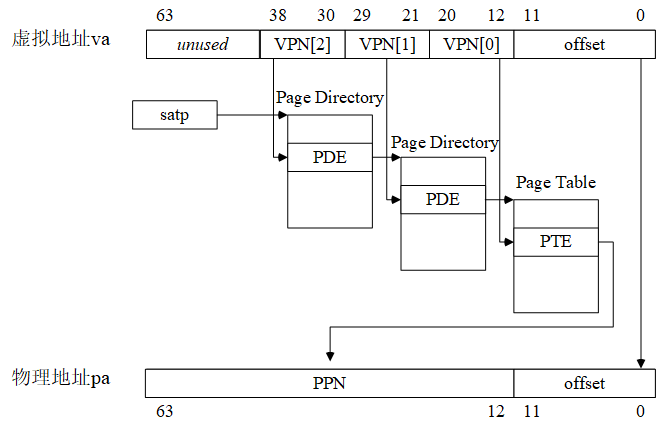

# 第四章．实验2：内存管理


### 目录 

- [4.1 实验2的基础知识](#fundamental) 
  - [4.1.1 Sv39虚地址管理方案回顾](#sv39)
  - [4.1.2 物理内存布局与规划](#physicalmemory)
  - [4.1.3 PKE操作系统和应用进程的逻辑地址空间结构](#virtualaddressspace)
  - [4.1.4 与页表操作相关的重要函数](#pagetablecook)
- [4.2 lab2_1 虚实地址转换](#lab2_1_pagetable)
  - [给定应用](#lab2_1_app)
  - [实验内容](#lab2_1_content)
  - [实验指导](#lab2_1_guide)
- [4.3 lab2_2 简单内存分配和回收](#lab2_2_allocatepage) 
  - [给定应用](#lab2_2_app)
  - [实验内容](#lab2_2_content)
  - [实验指导](#lab2_2_guide)
- [4.4 lab2_3 缺页异常](#lab2_3_pagefault) 
  - [给定应用](#lab2_3_app)
  - [实验内容](#lab2_3_content)
  - [实验指导](#lab2_3_guide)

<a name="fundamental"></a>

## 4.1 实验2的基础知识

在过去的[第一组实验(lab1)](chapter3_traps.md)中，为了简化设计，我们采用了Bare模式来完成虚拟地址到物理地址的转换（实际上，就是不转换，认为：虚拟地址=物理地址），也未开启（模拟）RISC-V机器的分页功能。在本组实验（实验2）中，我们将开启和使用Sv39页式虚拟内存管理，无论是操作系统内核还是应用，都通过页表来实现逻辑地址到物理地址的转换。

实际上，我们在本书的[第一章的1.5节](chapter1_riscv.md#paging)曾介绍过RISC-V的Sv39页式虚拟内存的管理方式，在本章，我们将尽量结合PKE的实验代码讲解RISC-V的Sv39虚拟内存管理机制，并通过3个基础实验加深读者对该管理机制的理解。

<a name="sv39"></a>

### 4.1.1 Sv39虚地址管理方案回顾

我们先回顾一下RISC-V的sv39虚地址管理方案，在该方案中，逻辑地址（就是我们的程序中各个符号，在链接时被赋予的地址）通过页表转换为其对应的物理地址。由于我们考虑的机器采用了RV64G指令集，意味着逻辑地址和物理地址理论上都是64位的。然而，对于逻辑地址，实际上我们的应用规模还用不到全部64位的寻找空间，所以Sv39方案中只使用了64位虚地址中的低39位（Sv48方案使用了低48位），意味着我们的应用程序的地址空间可以到512GB；对于物理地址，目前的RISC-V设计只用到了其中的低56位。

Sv39将39位虚拟地址“划分”为4个段（如下图所示）：

- [38,30]：共9位，图中的VPN[2]，用于在512（2^9）个页目录（page directory）项中检索页目录项（page directory entry, PDE）；
- [29,21]：共9位，图中的VPN[1]，用于在512（2^9）个页中间目录（page medium directory）中检索PDE；
- [20,12]：共9位，图中的VPN[0]，用于在512（2^9）个页表（page medium directory）中检索PTE；
- [11,0]：共12位，图中的offset，充当4KB页的页内位移。



图4.1 Sv39中虚拟地址到物理地址的转换过程

由于每个物理页的大小为4KB，同时，每个目录项（PDE）或页表项（PTE）占据8个字节，所以一个物理页能够容纳的PDE或PTE的数量为4KB/8B=512，这也是为什么VPN[2]=VPN[1]=VPN[0]=512的原因。

8字节的PDE或者PTE的格式如下：


图4.2 Sv39中PDE/PTE格式

其中的各个位的含意为：

● V（Valid）位决定了该PDE/PTE是否有效（V=1时有效），即是否有对应的实页。

● R（Read）、W（Write）和X（eXecutable）位分别表示此页对应的实页是否可读、可写和可执行。这3个位只对PTE有意义，对于PDE而言这3个位都为0。

● U（User）位表示该页是不是一个用户模式页。如果U=1，表示用户模式下的代码可以访问该页，否则就表示不能访问。S模式下的代码对U=1页面的访问取决于sstatus寄存器中的SUM字段取值。

● G（Global）位表示该PDE/PTE是不是全局的。我们可以把操作系统中运行的一个进程，认为是一个独立的地址空间，有时会希望某个虚地址空间转换可以在一组进程中共享，这种情况下，就可以将某个PDE的G位设置为1，达到这种共享的效果。

● A（Access）位表示该页是否被访问过。

● D（Dirty）位表示该页的内容是否被修改。

● RSW位（2位）是保留位，一般由运行在S模式的代码（如操作系统）来使用。

● PPN（44位）是物理页号（Physical Page Number，简写为PPN）。

其中PPN为44位的原因是：对于物理地址，现有的RISC-V规范只用了其中的56位，同时，这56位中的低12位为页内位移。所以，PPN的长度=56-12=44（位）。

<a name="physicalmemory"></a>

### 4.1.2 物理内存布局与规划

PKE实验用到的RISC-V机器，实际上是spike模拟出来的，例如，采用以下命令：

```
$ spike ./obj/riscv-pke ./obj/app_helloworld
```

spike将创建一个模拟的RISC-V机器，该机器拥有一个支持RV64G指令集的处理器，2GB的（模拟）物理内存。实际上，我们可以通过在spike命令行中使用`-m`开关指定模拟机器的物理内存大小，如使用`-m512`即可获得拥有512MB物理内存的模拟机器。默认的（2GB物理内存）配置等效于`-m2048`，在之后对模拟RISC-V机器物理内存布局的讨论中，我们将只考虑默认配置以简化论述。另外，也可以在spike命令行中使用`-p`开关指定模拟机器中处理器的个数，这样就可以模拟出一个多核的RISC-V平台了。

需要注意的是，**对于我们的模拟RISC-V机器而言，2GB的物理内存并不是从0地址开始编址，而是从0x80000000（见kernel/memlayout.h文件中的DRAM_BASE宏定义）开始编址的**。这样做的理由是，部分低物理地址[0x0, 0x80000000]并无物理内存与之对应，该空间留作了MMIO的用途。例如，我们在lab1_3中遇到的CLINT（Core Local Interrupter，timer中断的产生就是通过往这个地址写数据控制的），见kernel/riscv.h文件中的CLINT定义，的地址是0x2000000，就位于这一空间。从0x80000000开始对物理内存进行编址的好处是，避免类似x86平台那样产生内存空洞（memory hole，如640KB~1MB的BIOS空间），从而导致内存的浪费和管理上的复杂性。

我们的代理内核（构造出来的./obj/riscv-pke文件）的逻辑地址也是从0x80000000开始的，见kernel/kernel.lds文件中的内容，spike将代理内核载入（模拟）物理内存时，也是将该代理内核的代码段、数据段载入到0x80000000开始的内存空间，如图4.3所示。


图4.3 初始内存布局和载入操作系统内核后的内存布局

这样，操作系统内核的逻辑地址和物理地址就有了一一对应的关系，这也是我们在lab1中采用直模式（Bare mode）虚拟地址翻译机制也不会出错的原因。这里，需要解释的是对内核的机器模式栈的处理。通过实验一，我们知道机器模式栈是一个4KB的空间，它位于内核数据段，而不是专门分配一个额外的页面。这样（简单）处理的原因是PKE上运行的应用往往只有一个，算是非常简单的多任务环境，且操作系统利用机器模式栈的时机只有特殊的异常（如lab1_2中的非法指令异常）以及一些外部中断（如lab1_3中的时钟中断）。

如图4.3b所示，在spike将操作系统内核装入物理内存后，剩余的内存空间应该是从内核数据段的结束（_end符号）到0xffffffff（即4GB-1的地址）。但是由于PKE操作系统内核的特殊性（它只需要支持给定应用的运行），lab2的代码将操作系统管理的空间进一步缩减，定义了一个操作系统需要管理的最大内存空间（kernel/config.h文件），从而提升实验代码的执行速度：

```
 10 // the maximum memory space that PKE is allowed to manage
 11 #define PKE_MAX_ALLOWABLE_RAM 128 * 1024 * 1024
 12
 13 // the ending physical address that PKE observes
 14 #define PHYS_TOP (DRAM_BASE + PKE_MAX_ALLOWABLE_RAM)
```

可以看到，实验代码“人为”地将PKE操作系统所能管理的内存空间限制到了128MB（即PKE_MAX_ALLOWABLE_RAM的定义），同时，定义了PHYS_TOP为新的内存物理地址上限。实际上，kernel/pmm.c文件所定义的pmm_init()函数包含了PKE对物理内存进行管理的逻辑：

```
 60 void pmm_init() {
 61   // start of kernel program segment
 62   uint64 g_kernel_start = KERN_BASE;
 63   uint64 g_kernel_end = (uint64)&_end;
 64
 65   uint64 pke_kernel_size = g_kernel_end - g_kernel_start;
 66   sprint("PKE kernel start 0x%lx, PKE kernel end: 0x%lx, PKE kernel size: 0x%lx .\n", g_kernel_start, g_kernel_end, pke_kernel_size);
 67
 68   // free memory starts from the end of PKE kernel and must be page-aligined
 69   free_mem_start_addr = ROUNDUP(g_kernel_end , PGSIZE);
 70
 71   // recompute g_mem_size to limit the physical memory space that PKE kernel needs to manage
 72   g_mem_size = MIN(PKE_MAX_ALLOWABLE_RAM, g_mem_size);
 73   if( g_mem_size < pke_kernel_size )
 74     panic( "Error when recomputing physical memory size (g_mem_size).\n" );
 75
 76   free_mem_end_addr = g_mem_size + DRAM_BASE;
 77   sprint("free physical memory address: [0x%lx, 0x%lx] \n", free_mem_start_addr, free_mem_end_addr - 1);
 78
 79   sprint("kernel memory manager is initializing ...\n");
 80   // create the list of free pages
 81   create_freepage_list(free_mem_start_addr, free_mem_end_addr);
 82 }
```

在72行，pmm_init()函数会计算g_mem_size，其值在PKE_MAX_ALLOWABLE_RAM和spike所模拟的物理内存大小中取最小值，也就是说除非spike命令行参数中-m参数后面所带的数字小于128（即128M），g_mem_size的大小将为128MB。

另外，为了对空闲物理内存（地址范围为[_end，g_mem_size+DRAM_BASE(即PHYS_TOP)]）进行有效管理，pmm_init()函数在81行通过调用create_freepage_list()函数定义了一个链表，用于对空闲物理内存的分配和回收。kernel/pmm.c文件中包含了所有对物理内存的初始化、分配和回收的例程，它们的实现非常的简单，感兴趣的读者请对里面的函数进行阅读理解。

<a name="virtualaddressspace"></a>

### 4.1.3 PKE操作系统和应用进程的逻辑地址空间结构

通过4.1.2的讨论，我们知道对于PKE内核来说，有逻辑地址=物理地址的关系成立，这也是在实验一中我们可以采用Bare模式进行地址映射的原因。采用Bare模式的地址映射，在进行内存访问时，无需经过页表和硬件进行逻辑地址到物理地址的转换。然而，在实验二中我们将采用Sv39虚拟地址管理方案，通过页表和硬件（spike模拟的MMU）进行访存地址的转换。为实现这种转换，首先需要确定的就是将要被转换的逻辑地址空间，即需要对哪部分逻辑地址空间进行转换的问题。在PKE的实验二中，存在两个需要被转换的实体，一个是操作系统内核，另一个是我们的实验给定的应用程序所对应的进程。下面我们对它们分别讨论：

#### 操作系统内核

操作系统内核的逻辑地址与物理地址存在一一对应的关系，但是在开启了Sv39虚拟内存管理方案后，所有的逻辑地址到物理地址的翻译都**必须**通过页表和MMU硬件进行，所以，为操作系统内核建立页表是必不可少的工作。操作系统的逻辑地址空间可以简单的认为是从内核代码段的起始（即KERN_BASE=0x80000000）到物理地址的顶端（也就是PHYS_TOP），因为操作系统是系统中拥有最高权限的软件，需要实现对所有物理内存空间的直接管理。这段逻辑地址空间，即[KERN_BASE，PHYS_TOP]，所映射的物理地址空间也是[KERN_BASE，PHYS_TOP]。也就是说对于操作系统内核，我们在实验二中通过Sv39的页表，仍然保持和实验一一样的逻辑地址到物理地址的一一对应关系。在权限方面，对于内核代码段所对应的页面来说是可读可执行，对于数据段以及空闲内存空间，其权限为可读可写。


图4.4 PKE操作系统内核的逻辑地址空间和它到物理地址空间的映射

操作系统内核建立页表的过程可以参考kernel/vmm.c文件中的kern_vm_init()函数的实现，需要说明的是kern_vm_init()函数在PKE操作系统内核的S态初始化过程（s_start函数）中被调用：

```
114 void kern_vm_init(void) {
115   pagetable_t t_page_dir;
116
117   // allocate a page (t_page_dir) to be the page directory for kernel
118   t_page_dir = (pagetable_t)alloc_page();
119   memset(t_page_dir, 0, PGSIZE);
120
121   // map virtual address [KERN_BASE, _etext] to physical address [DRAM_BASE, DRAM_BASE+(_etext - KERN_BASE)],
122   // to maintain (direct) text section kernel address mapping.
123   kern_vm_map(t_page_dir, KERN_BASE, DRAM_BASE, (uint64)_etext - KERN_BASE,
124          prot_to_type(PROT_READ | PROT_EXEC, 0));
125
126   sprint("KERN_BASE 0x%lx\n", lookup_pa(t_page_dir, KERN_BASE));
127
128   // also (direct) map remaining address space, to make them accessable from kernel.
129   // this is important when kernel needs to access the memory content of user's app without copying pages
130   // between kernel and user spaces.
131   kern_vm_map(t_page_dir, (uint64)_etext, (uint64)_etext, PHYS_TOP - (uint64)_etext,
132          prot_to_type(PROT_READ | PROT_WRITE, 0));
133
134   sprint("physical address of _etext is: 0x%lx\n", lookup_pa(t_page_dir, (uint64)_etext));
135
136   g_kernel_pagetable = t_page_dir;
137 }
```

我们看到，kern_vm_init()函数会首先（118行）从空闲物理内存中获取（分配）一个t_page_dir指针所指向的物理页，该页将作为内核页表的根目录（page directory，对应图4.1中的VPN[2]）。接下来，将该页的内容清零（119行）、映射代码段到它对应的物理地址（123--124行）、映射数据段的起始到PHYS_TOP到它对应的物理地址空间（131--132行），最后记录内核页表的根目录页（136行）。

####  应用进程

对于实验一的所有应用，我们通过指定应用程序中所有的符号地址对应的逻辑地址的方法（参见[第三章的3.1.3节](chapter3_traps.md#subsec_lds)），将应用程序中的逻辑地址“强行”对应到图4.3中的“实际空闲内存”空间，并在ELF加载时将程序段加载到了这块内存空间中的对应位置，从而使得应用程序（所对应的进程）也可以采用类似操作系统内核那样的直映射（Bare模式）方式。然而，这样做是因为实验一中的应用都是单线程应用，它们的执行并不会产生新的执行体（如子进程），所以可以采用指定逻辑地址的办法进行简化。但是实际情况是，我们在代理内核上是有可能执行多进程应用的，特别是在开发板上验证多核RISC-V处理器的场景（我们在实验三中，也将开始讨论在PKE实验中实现和完善进程的管理）。在这种场景下，由于无法保证应用所要求的逻辑地址空间“恰好”能找到对应的物理地址空间，且后者还未被占据。

这里，我们可以观察一下在未指定逻辑地址的情况下的应用对应的逻辑地址。首先切换到lab2_1_pagetable，然后构造内核和应用：

```
// 切换到lab2_1_pagetable分支
$ git checkout lab2_1_pagetable
// 构造内核和应用
$ make
// 显示应用程序中将被加载的程序段
$ riscv64-unknown-elf-readelf -l ./obj/app_helloworld_no_lds

Elf file type is EXEC (Executable file)
Entry point 0x100f6
There is 1 program header, starting at offset 64

Program Headers:
  Type           Offset             VirtAddr           PhysAddr
                 FileSiz            MemSiz              Flags  Align
  LOAD           0x0000000000000000 0x0000000000010000 0x0000000000010000
                 0x0000000000000360 0x0000000000000360  R E    0x1000

 Section to Segment mapping:
  Segment Sections...
   00     .text .rodata
```

通过以上结果，我们看到，lab2_1的应用app_helloworld_no_lds（实际上就是lab1_1中的app_helloworld，不同的地方在于没有用到lab1_1中的user/user.lds来约束逻辑地址）只包含一个代码段，它的起始地址为0x0000000000010000（即0x10000）。

对比[4.1.2节](#physicalmemory)中讨论的物理内存布局，我们知道spike模拟的RISC-V机器并无处于0x10000的物理地址空间与其对应。这样，我们就需要通过Sv39虚地址管理方案将0x10000开始的代码段，映射到app_helloworld_no_lds中代码段**实际**被加载到的物理内存（显然位于图4.3中的“实际内存空间”所标识的区域）区域。

PKE实验二中的应用加载是通过kernel/kernel.c文件中的load_user_program函数来完成的：

```
 37 void load_user_program(process *proc) {
 38   sprint("User application is loading.\n");
 39   proc->trapframe = (trapframe *)alloc_page();  //trapframe
 40   memset(proc->trapframe, 0, sizeof(trapframe));
 41
 42   //user pagetable
 43   proc->pagetable = (pagetable_t)alloc_page();
 44   memset((void *)proc->pagetable, 0, PGSIZE);
 45
 46   proc->kstack = (uint64)alloc_page() + PGSIZE;   //user kernel stack top
 47   uint64 user_stack = (uint64)alloc_page();       //phisical address of user stack bottom
 48   proc->trapframe->regs.sp = USER_STACK_TOP;  //virtual address of user stack top
 49
 50   sprint("user frame 0x%lx, user stack 0x%lx, user kstack 0x%lx \n", proc->trapframe,
 51          proc->trapframe->regs.sp, proc->kstack);
 52
 53   load_bincode_from_host_elf(proc);
 54
 55   // map user stack in userspace
 56   user_vm_map((pagetable_t)proc->pagetable, USER_STACK_TOP - PGSIZE, PGSIZE, user_stack,
 57          prot_to_type(PROT_WRITE | PROT_READ, 1));
 58
 59   // map trapframe in user space (direct mapping as in kernel space).
 60   user_vm_map((pagetable_t)proc->pagetable, (uint64)proc->trapframe, PGSIZE, (uint64)proc->trapframe,
 61          prot_to_type(PROT_WRITE | PROT_READ, 0));
 62
 63   // map S-mode trap vector section in user space (direct mapping as in kernel space)
 64   // we assume that the size of usertrap.S is smaller than a page.
 65   user_vm_map((pagetable_t)proc->pagetable, (uint64)trap_sec_start, PGSIZE, (uint64)trap_sec_start,
 66          prot_to_type(PROT_READ | PROT_EXEC, 0));
 67 }
```

load_user_program()函数对于应用进程逻辑空间的操作可以分成以下几个部分：

- （39--40行）分配一个物理页面，将其作为栈帧（trapframe），即发生中断时保存用户进程执行上下文的内存空间。由于物理页面都是从位于物理地址范围[_end，PHYS_TOP]的空间中分配的，它的首地址也将位于该区间。所以第60--61行的映射，也是做一个proc->trapframe到所分配页面的直映射（逻辑地址=物理地址）。

- （43--44行）分配一个物理页面作为存放进程页表根目录（page directory，对应图4.1中的VPN[2]）的空间。

- （46行）分配了一个物理页面，作为用户进程的内核态栈，该栈将在用户进程进入中断处理时用作S模式内核处理函数使用的栈。然而，这个栈并未映射到用户进程的逻辑地址空间，而是将其首地址保存在proc->kstack中。

- （47--48行）再次分配一个物理页面，作为用户进程的用户态栈，该栈供应用在用户模式下使用，并在第56--57行映射到用户进程的逻辑地址USER_STACK_TOP。
- （53行）调用load_bincode_from_host_elf()函数，该函数将读取应用所对应的ELF文件，并将其中的代码段读取到新分配的内存空间（物理地址位于[_end，PHYS_TOP]区间）。
- （65--66行）将内核中的S态trap入口函数所在的物理页一一映射到用户进程的逻辑地址空间。

通过以上load_user_program()函数，我们可以大致画出用户进程的逻辑地址空间，以及该地址空间到物理地址空间的映射。


<a name="user_vm_space"></a>

图4.5 用户进程的逻辑地址空间和到物理地址空间的映射

我们看到，用户进程在装入后，其逻辑地址空间有4个区间建立了和物理地址空间的映射。从上往下观察，“用户进程trapframe”和“trap入口页面”的逻辑地址大于0x80000000，且与承载它们的物理空间建立了一对一的映射关系。另外两个区间，即“用户态栈”和“用户代码段”的逻辑地址都低于0x80000000，它们所对应的物理空间则都位于实际空闲内存区域，同时，这种映射的逻辑地址显然不等于物理地址。

<a name="pagetablecook"></a>

### 4.1.4 与页表操作相关的重要函数

实验二与页表操作相关的函数都放在kernel/vmm.c文件中，其中比较重要的函数有：

- int map_pages(pagetable_t page_dir, uint64 va, uint64 size, uint64 pa, int perm);

该函数的第一个输入参数page_dir为根目录所在物理页面的首地址，第二个参数va则是将要被映射的逻辑地址，第三个参数size为所要建立映射的区间的长度，第四个参数pa为逻辑地址va所要被映射到的物理地址首地址，最后（第五个）的参数perm为映射建立后页面访问的权限。

总的来说，该函数将在给定的page_dir所指向的根目录中，建立[va，va+size]到[pa，pa+size]的映射。

- pte_t *page_walk(pagetable_t page_dir, uint64 va, int alloc);

该函数的第一个输入参数page_dir为根目录所在物理页面的首地址，第二个参数va为所要查找（walk）的逻辑地址，第三个参数实际上是一个bool类型：当它为1时，如果它所要查找的逻辑地址并未建立与物理地址的映射（图4.1中的Page Medium Directory）不存在，则通过分配内存空间建立从根目录到页表的完整映射，并最终返回va所对应的页表项；当它为0时，如果它所要查找的逻辑地址并未建立与物理地址的映射，则返回NULL，否则返回va所对应的页表项。

- uint64 lookup_pa(pagetable_t pagetable, uint64 va);

查找逻辑地址va所对应的物理地址pa。如果没有与va对应的物理页面，则返回NULL；否则，返回va对应的物理地址。


<a name="lab2_1_pagetable"></a>

## 4.2 lab2_1 虚实地址转换

<a name="lab2_1_app"></a>

#### **给定应用**

- user/app_helloworld_no_lds.c

```
  1 /*
  2  * Below is the given application for lab2_1.
  3  * This app runs in its own address space, in contrast with in direct mapping.
  4  */
  5
  6 #include "user_lib.h"
  7 #include "util/types.h"
  8
  9 int main(void) {
 10   printu("Hello world!\n");
 11   exit(0);
 12 }
```

该应用的代码跟lab1_1是一样的。但是，不同的地方在于，它的编译和链接并未指定程序中符号的逻辑地址。

- 切换到lab2_1，继承lab1_3中所做的修改，并make后的直接运行结果：

```
//切换到lab2_1
$ git checkout lab2_1_pagetable

//继承lab1_3以及之前的答案
$ git merge lab1_3_irq -m "continue to work on lab2_1"

//重新构造
$ make clean; make

//运行构造结果
$ spike ./obj/riscv-pke ./obj/app_helloworld_no_lds
In m_start, hartid:0
HTIF is available!
(Emulated) memory size: 2048 MB
Enter supervisor mode...
PKE kernel start 0x0000000080000000, PKE kernel end: 0x000000008000e000, PKE kernel size: 0x000000000000e000 .
free physical memory address: [0x000000008000e000, 0x0000000087ffffff]
kernel memory manager is initializing ...
KERN_BASE 0x0000000080000000
physical address of _etext is: 0x0000000080004000
kernel page table is on
User application is loading.
user frame 0x0000000087fbc000, user stack 0x000000007ffff000, user kstack 0x0000000087fbb000
Application: ./obj/app_helloworld_no_lds
Application program entry point (virtual address): 0x00000000000100f6
Switching to user mode...
You have to implement user_va_to_pa (convert user va to pa) to print messages in lab2_1.

System is shutting down with exit code -1.
```

从以上运行结果来看，我们的应用app_helloworld_no_lds并未如愿地打印出“Hello world!\n”，这是因为user/app_helloworld_no_lds.c的第10行`printu("Hello world!\n");`中的“Hello world!\n”字符串本质上是存储在.rodata段，它被和代码段（.text）一起被装入内存。从逻辑地址结构来看，它的逻辑地址就应该位于图4.5中的“用户代码段”，显然低于0x80000000。

而printu是一个典型的系统调用（参考[lab1_1](chapter3_traps.md#syscall)的内容），它的执行逻辑是通过ecall指令，陷入到内核（S模式）完成到屏幕的输出。然而，对于内核而言，显然不能继续使用“Hello world!\n”的逻辑地址对它进行访问，而必须将其转换成物理地址（因为如图4.4所示，操作系统内核已建立了到“实际空闲内存”的直映射）。而lab2_1的代码，显然未实现这种转换。

<a name="lab2_1_content"></a>

#### **实验内容**

实现user_va_to_pa()函数，完成给定逻辑地址到物理地址的转换，并获得以下预期结果：

```
$ spike ./obj/riscv-pke ./obj/app_helloworld_no_lds
In m_start, hartid:0
HTIF is available!
(Emulated) memory size: 2048 MB
Enter supervisor mode...
PKE kernel start 0x0000000080000000, PKE kernel end: 0x000000008000e000, PKE kernel size: 0x000000000000e000 .
free physical memory address: [0x000000008000e000, 0x0000000087ffffff]
kernel memory manager is initializing ...
KERN_BASE 0x0000000080000000
physical address of _etext is: 0x0000000080004000
kernel page table is on
User application is loading.
user frame 0x0000000087fbc000, user stack 0x000000007ffff000, user kstack 0x0000000087fbb000
Application: ./obj/app_helloworld_no_lds
Application program entry point (virtual address): 0x00000000000100f6
Switching to user mode...
Hello world!
User exit with code:0.
System is shutting down with exit code 0.
```

<a name="lab2_1_guide"></a>

#### **实验指导**

读者可以参考[lab1_1](chapter3_traps.md#syscall)的内容，重走从应用的printu到S态的系统调用的完整路径，最终来到kernel/syscall.c文件的sys_user_print()函数：

```
 21 ssize_t sys_user_print(const char* buf, size_t n) {
 22   //buf is an address in user space on user stack,
 23   //so we have to transfer it into phisical address (kernel is running in direct mapping).
 24   assert( current );
 25   char* pa = (char*)user_va_to_pa((pagetable_t)(current->pagetable), (void*)buf);
 26   sprint(pa);
 27   return 0;
 28 }
```

该函数最终在第26行通过调用sprint将结果输出，但是在输出前，需要将buf地址转换为物理地址传递给sprint，这一转换是通过user_va_to_pa()函数完成的。而user_va_to_pa()函数的定义在kernel/vmm.c文件中定义：

```
144 void *user_va_to_pa(pagetable_t page_dir, void *va) {
145   //TODO: implement user_va_to_pa to convert a given user virtual address "va" to its corresponding
146   // physical address, i.e., "pa". To do it, we need to walk through the page table, starting from its
147   // directory "page_dir", to locate the PTE that maps "va". If found, returns the "pa" by using:
148   // pa = PYHS_ADDR(PTE) + (va - va & (1<<PGSHIFT -1))
149   // Here, PYHS_ADDR() means retrieving the starting address (4KB aligned), and (va - va & (1<<PGSHIFT -1))
150   // means computing the offset of "va" in its page.
151   // Also, it is possible that "va" is not mapped at all. in such case, we can find invalid PTE, and
152   // should return NULL.
153   panic( "You have to implement user_va_to_pa (convert user va to pa) to print messages in lab2_1.\n" );
154
155 }
```

如注释中的提示，为了在page_dir所指向的页表中查找逻辑地址va，就必须通过调用[页表操作相关函数](#pagetablecook)找到包含va的页表项（PTE），通过该PTE的内容得知va所在的物理页面的首地址，最后再通过计算va在页内的位移得到va最终对应的物理地址。

<a name="lab2_2_allocatepage"></a>

## 4.3 lab2_2 简单内存分配和回收

<a name="lab2_2_app"></a>

#### **给定应用**

- user/app_naive_malloc.c

```
  1 /*
  2  * Below is the given application for lab2_2.
  3  */
  4
  5 #include "user_lib.h"
  6 #include "util/types.h"
  7
  8 struct my_structure {
  9   char c;
 10   int n;
 11 };
 12
 13 int main(void) {
 14   struct my_structure* s = (struct my_structure*)naive_malloc();
 15   s->c = 'a';
 16   s->n = 1;
 17
 18   printu("s: %lx, {%c %d}\n", s, s->c, s->n);
 19
 20   naive_free(s);
 21
 22   exit(0);
 23 }
```

该应用的逻辑非常简单：首先分配一个空间（内存页面）来存放my_structure结构，往my_structure结构的实例中存储信息，打印信息，并最终将之前所分配的空间释放掉。这里，新定义了两个用户态函数naive_malloc()和naive_free()，它们最终会转换成系统调用，完成内存的分配和回收操作。

- 切换到lab2_2，继承lab2_1以及之前实验所做的修改，并make后的直接运行结果：

```
//切换到lab2_2
$ git checkout lab2_2_allocatepage

//继承lab2_1以及之前的答案
$ git merge lab2_1_pagetable -m "continue to work on lab2_2"

//重新构造
$ make clean; make

//运行构造结果
$ spike ./obj/riscv-pke ./obj/app_naive_malloc
In m_start, hartid:0
HTIF is available!
(Emulated) memory size: 2048 MB
Enter supervisor mode...
PKE kernel start 0x0000000080000000, PKE kernel end: 0x000000008000e000, PKE kernel size: 0x000000000000e000 .
free physical memory address: [0x000000008000e000, 0x0000000087ffffff]
kernel memory manager is initializing ...
KERN_BASE 0x0000000080000000
physical address of _etext is: 0x0000000080004000
kernel page table is on
User application is loading.
user frame 0x0000000087fbc000, user stack 0x000000007ffff000, user kstack 0x0000000087fbb000
Application: ./obj/app_naive_malloc
Application program entry point (virtual address): 0x0000000000010078
Switching to user mode...
s: 0000000000400000, {a 1}
You have to implement user_vm_unmap to free pages using naive_free in lab2_2.

System is shutting down with exit code -1.
```

从输出结果来看，`s: 0000000000400000, {a 1}`的输出说明分配内存已经做好（也就是说naive_malloc函数及其内核功能的实现已完成），且打印出了我们预期的结果。但是，naive_free对应的功能并未完全做好。

<a name="lab2_2_content"></a>

#### **实验内容**

如输出提示所表明的那样，需要完成naive_free对应的功能，并获得以下预期的结果输出：

```
$ spike ./obj/riscv-pke ./obj/app_naive_malloc
In m_start, hartid:0
HTIF is available!
(Emulated) memory size: 2048 MB
Enter supervisor mode...
PKE kernel start 0x0000000080000000, PKE kernel end: 0x000000008000e000, PKE kernel size: 0x000000000000e000 .
free physical memory address: [0x000000008000e000, 0x0000000087ffffff]
kernel memory manager is initializing ...
KERN_BASE 0x0000000080000000
physical address of _etext is: 0x0000000080004000
kernel page table is on
User application is loading.
user frame 0x0000000087fbc000, user stack 0x000000007ffff000, user kstack 0x0000000087fbb000
Application: ./obj/app_naive_malloc
Application program entry point (virtual address): 0x0000000000010078
Switching to user mode...
s: 0000000000400000, {a 1}
User exit with code:0.
System is shutting down with exit code 0.
```

<a name="lab2_2_guide"></a>

#### **实验指导**

一般来说，应用程序执行过程中的动态内存分配和回收，是操作系统中的堆（Heap）管理的内容。在本实验中，我们实际上是为PKE操作系统内核实现一个简单到不能再简单的“堆”。为实现naive_free()的内存回收过程，我们需要了解其对偶过程，即内存是如何“分配”给应用程序，并供后者使用的。为此，我们先阅读kernel/syscall.c文件中的naive_malloc()函数的底层实现，sys_user_allocate_page()：

```
 43 uint64 sys_user_allocate_page() {
 44   void* pa = alloc_page();
 45   uint64 va = g_ufree_page;
 46   g_ufree_page += PGSIZE;
 47   user_vm_map((pagetable_t)current->pagetable, va, PGSIZE, (uint64)pa,
 48          prot_to_type(PROT_WRITE | PROT_READ, 1));
 49
 50   return va;
 51 }
```

这个函数在44行分配了一个首地址为pa的物理页面，这个物理页面要以何种方式映射给应用进程使用呢？第55行给出了pa对应的逻辑地址va = g_ufree_page，并在56行对g_ufree_page进行了递增操作。最后在47--48行，将pa映射给了va地址。这个过程中，g_ufree_page是如何定义的呢？我们可以找到它在kernel/process.c文件中的定义：

```
 27 // start virtual address of our simple heap.
 28 uint64 g_ufree_page = USER_FREE_ADDRESS_START;
```

而USER_FREE_ADDRESS_START的定义在kernel/memlayout.h文件：

```
 17 // simple heap bottom, virtual address starts from 4MB
 18 #define USER_FREE_ADDRESS_START 0x00000000 + PGSIZE * 1024
```

可以看到，在我们的PKE操作系统内核中，应用程序执行过程中所动态分配（类似malloc）的内存是被映射到USER_FREE_ADDRESS_START（4MB）开始的地址的。那么，这里的USER_FREE_ADDRESS_START对应图4.5中的用户进程的逻辑地址空间的哪个部分呢？**这一点请读者自行判断，并分析为什么是4MB，以及能不能用其他的逻辑地址？**

以上了解了内存的分配过程后，我们就能够大概了解其反过程的回收应该怎么做了，大概分为以下步骤：

- 找到一个给定va所对应的页表项PTE（查找[4.1.4节](pagetablecook)，看哪个函数能满足此需求）；
- 如果找到（过滤找不到的情形），通过该PTE的内容得知va所对应物理页的首地址pa；
- 回收pa对应的物理页，并将PTE中的Valid位置为0。


<a name="lab2_3_pagefault"></a>

## 4.4 lab2_3 缺页异常

<a name="lab2_3_app"></a>

#### **给定应用**

- user/app_sum_sequence.c

```
  1 /*
  2  * The application of lab2_3.
  3  */
  4
  5 #include "user_lib.h"
  6 #include "util/types.h"
  7
  8 //
  9 // compute the summation of an arithmetic sequence. for a given "n", compute
 10 // result = n + (n-1) + (n-2) + ... + 0
 11 // sum_sequence() calls itself recursively till 0. The recursive call, however,
 12 // may consume more memory (from stack) than a physical 4KB page, leading to a page fault.
 13 // PKE kernel needs to improved to handle such page fault by expanding the stack.
 14 //
 15 uint64 sum_sequence(uint64 n) {
 16   if (n == 0)
 17     return 0;
 18   else
 19     return sum_sequence( n-1 ) + n;
 20 }
 21
 22 int main(void) {
 23   // we need a large enough "n" to trigger pagefaults in the user stack
 24   uint64 n = 1000;
 25
 26   printu("Summation of an arithmetic sequence from 0 to %ld is: %ld \n", n, sum_sequence(1000) );
 27   exit(0);
 28 }
```

给定一个递增的等差数列：`0, 1, 2, ..., n`，如何求该数列的和？以上的应用给出了它的递归（recursive）解法。通过定义一个函数sum_sequence(n)，将求和问题转换为sum_sequence(n-1) + n的问题。问题中n依次递减，直至为0时令sum_sequence(0)=0。

- 切换到lab2_3、继承lab2_2及以前所做修改，并make后的直接运行结果：

```
//切换到lab2_3
$ git checkout lab2_3_pagefault

//继承lab2_2以及之前的答案
$ git merge lab2_2_allocatepage -m "continue to work on lab2_3"

//重新构造
$ make clean; make

//运行构造结果
$ spike ./obj/riscv-pke ./obj/app_sum_sequence
In m_start, hartid:0
HTIF is available!
(Emulated) memory size: 2048 MB
Enter supervisor mode...
PKE kernel start 0x0000000080000000, PKE kernel end: 0x000000008000e000, PKE kernel size: 0x000000000000e000 .
free physical memory address: [0x000000008000e000, 0x0000000087ffffff]
kernel memory manager is initializing ...
KERN_BASE 0x0000000080000000
physical address of _etext is: 0x0000000080004000
kernel page table is on
User application is loading.
user frame 0x0000000087fbc000, user stack 0x000000007ffff000, user kstack 0x0000000087fbb000
Application: ./obj/app_sum_sequence
Application program entry point (virtual address): 0x0000000000010096
Switching to user mode...
handle_page_fault: 000000007fffdff8
You need to implement the operations that actually handle the page fault in lab2_3.

System is shutting down with exit code -1.
```

以上执行结果，为什么会出现handle_page_fault呢？这就跟我们给出的应用程序（递归求解等差数列的和）有关了。

递归解法的特点是，函数调用的路径会被完整地保存在栈（stack）中，也就是说函数的下一次调用会将上次一调用的现场（包括参数）压栈，直到n=0时依次返回到最开始给定的n值，从而得到最终的计算结果。显然，在以上计算等差数列的和的程序中，n值给得越大，就会导致越深的栈，而栈越深需要的内存空间也就越多。

通过[4.1.3节](#virtualaddressspace)中对用户进程逻辑地址空间的讨论，以及图4.5的图示，我们知道应用程序最开始被载入（并装配为用户进程）时，它的用户态栈空间（栈底在0x7ffff000，即USER_STACK_TOP）仅有1个4KB的页面。显然，只要以上的程序给出的n值“足够”大，就一定会“压爆”用户态栈。而以上运行结果中，出问题的地方（即handle_page_fault后出现的地址，0x7fffdff8）也恰恰在用户态栈所对应的空间。

以上分析表明，之所以运行./obj/app_sum_sequence会出现错误（handle_page_fault），是因为给sum_sequence()函数的n值太大，把用户态栈“压爆”了。

<a name="lab2_3_content"></a>

#### **实验内容**

在PKE操作系统内核中完善用户态栈空间的管理，使得它能够正确处理用户进程的“压栈”请求。

实验完成后的运行结果：

```
$ spike ./obj/riscv-pke ./obj/app_sum_sequence
In m_start, hartid:0
HTIF is available!
(Emulated) memory size: 2048 MB
Enter supervisor mode...
PKE kernel start 0x0000000080000000, PKE kernel end: 0x000000008000e000, PKE kernel size: 0x000000000000e000 .
free physical memory address: [0x000000008000e000, 0x0000000087ffffff]
kernel memory manager is initializing ...
KERN_BASE 0x0000000080000000
physical address of _etext is: 0x0000000080004000
kernel page table is on
User application is loading.
user frame 0x0000000087fbc000, user stack 0x000000007ffff000, user kstack 0x0000000087fbb000
Application: ./obj/app_sum_sequence
Application program entry point (virtual address): 0x0000000000010096
Switching to user mode...
handle_page_fault: 000000007fffdff8
handle_page_fault: 000000007fffcff8
handle_page_fault: 000000007fffbff8
Summation of an arithmetic sequence from 0 to 1000 is: 500500
User exit with code:0.
System is shutting down with exit code 0.
```

<a name="lab2_3_guide"></a>

#### **实验指导**

本实验需要结合[lab1_2](chapter3_traps.md#exception)中的异常处理知识，但要注意的是，lab1_2中我们处理的是非法指令异常，对该异常的处理足够操作系统将应用进程“杀死”。本实验中，我们处理的是缺页异常（app_sum_sequence.c执行的显然是“合法”操作），不能也不应该将应用进程杀死。正确的做法是：首先，通过异常的类型，判断我们处理的确实是缺页异常；接下来，判断发生缺页的是不是用户栈空间，如果是则分配一个物理页空间，最后将该空间通过vm_map“粘”到用户栈上以扩充用户栈空间。

另外，lab1_2中处理的非法指令异常是在M模式下处理的，原因是我们根本没有将该异常代理给S模式。但是，对于本实验中的缺页异常是不是也是需要在M模式处理呢？我们先回顾以下kernel/machine/minit.c文件中的delegate_traps()函数：

```
 51 static void delegate_traps() {
 52   if (!supports_extension('S')) {
 53     // confirm that our processor supports supervisor mode. abort if not.
 54     sprint("s mode is not supported.\n");
 55     return;
 56   }
 57
 58   uintptr_t interrupts = MIP_SSIP | MIP_STIP | MIP_SEIP;
 59   uintptr_t exceptions = (1U << CAUSE_MISALIGNED_FETCH) | (1U << CAUSE_FETCH_PAGE_FAULT) |
 60                          (1U << CAUSE_BREAKPOINT) | (1U << CAUSE_LOAD_PAGE_FAULT) |
 61                          (1U << CAUSE_STORE_PAGE_FAULT) | (1U << CAUSE_USER_ECALL);
 62
 63   write_csr(mideleg, interrupts);
 64   write_csr(medeleg, exceptions);
 65   assert(read_csr(mideleg) == interrupts);
 66   assert(read_csr(medeleg) == exceptions);
 67 }
```

而在本实验的应用中，产生缺页异常的本质还是应用往未被映射的内存空间“写”（以及后续的访问）所导致的，所以CAUSE_STORE_PAGE_FAULT是我们应该关注的异常。通过阅读delegate_traps()函数，我们看到该函数显然已将缺页异常（CAUSE_STORE_PAGE_FAULT）代理给了S模式，所以，接下来我们就应阅读kernel/strap.c文件中对于这类异常的处理：

```
 42 void handle_user_page_fault(uint64 mcause, uint64 sepc, uint64 stval) {
 43   sprint("handle_page_fault: %lx\n", stval);
 44   switch (mcause) {
 45     case CAUSE_STORE_PAGE_FAULT:
 46       // TODO: implement the operations that solve the page fault to dynamically increase application stack.
 47       // hint: first allocate a new physical page, and then, maps the new page to the virtual address that
 48       // causes the page fault.
 49       panic( "You need to implement the operations that actually handle the page fault in lab2_3.\n" );
 50
 51       break;
 52     default:
 53       sprint("unknown page fault.\n");
 54       break;
 55   }
 56 }
```

这里，我们找到了之前运行./obj/app_sum_sequence出错的地方，我们只需要改正这一错误实现缺页处理，使得程序获得正确的输出就好。实现缺页处理的思路如下：

- 通过输入的参数stval（存放的是发生缺页异常时，程序想要访问的逻辑地址）判断缺页的逻辑地址在用户进程逻辑地址空间中的位置，看是不是比USER_STACK_TOP更大，且比我们预设的可能的用户栈最大空间小（这里，我们可以给用户栈一个上限，例如20个4KB的页面）；
- 分配一个物理页，将所分配的物理页面映射到stval所对应的虚拟地址上。

